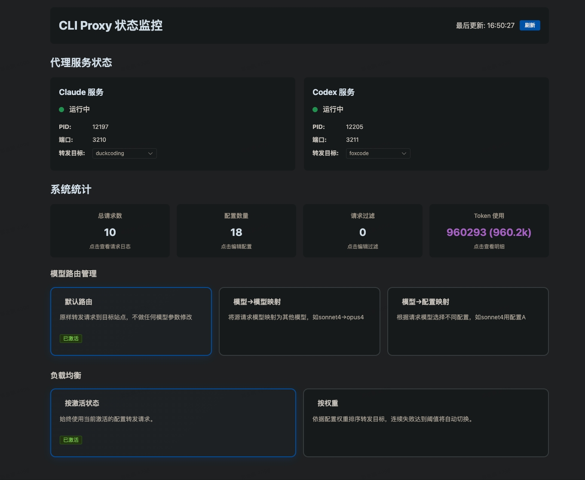
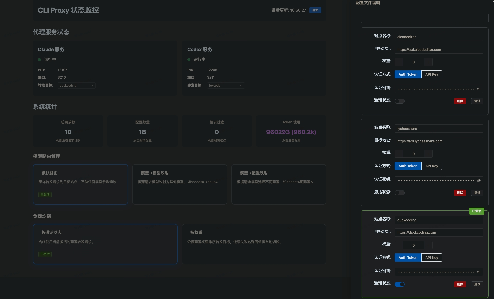
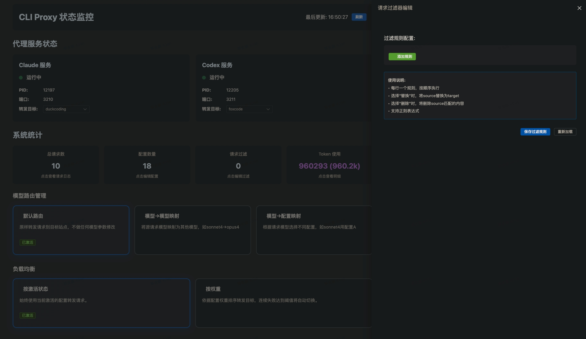
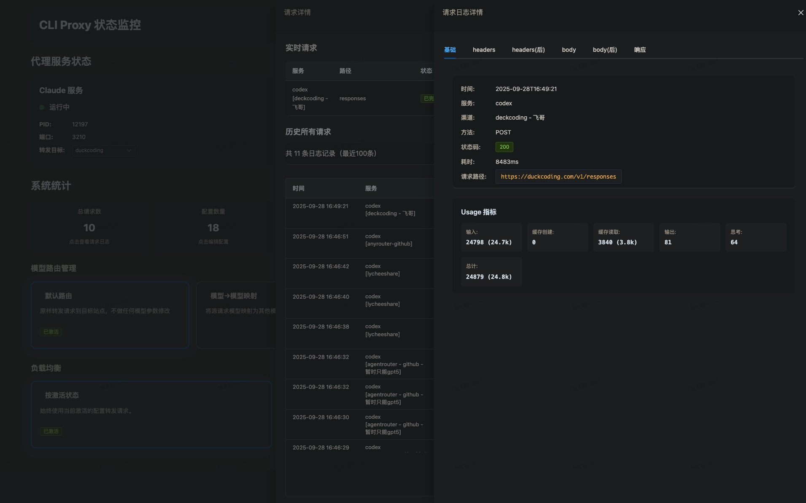
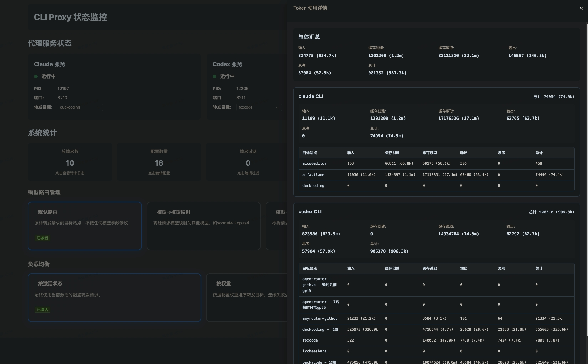
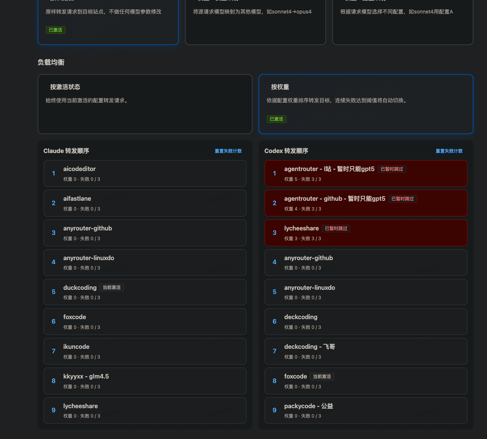
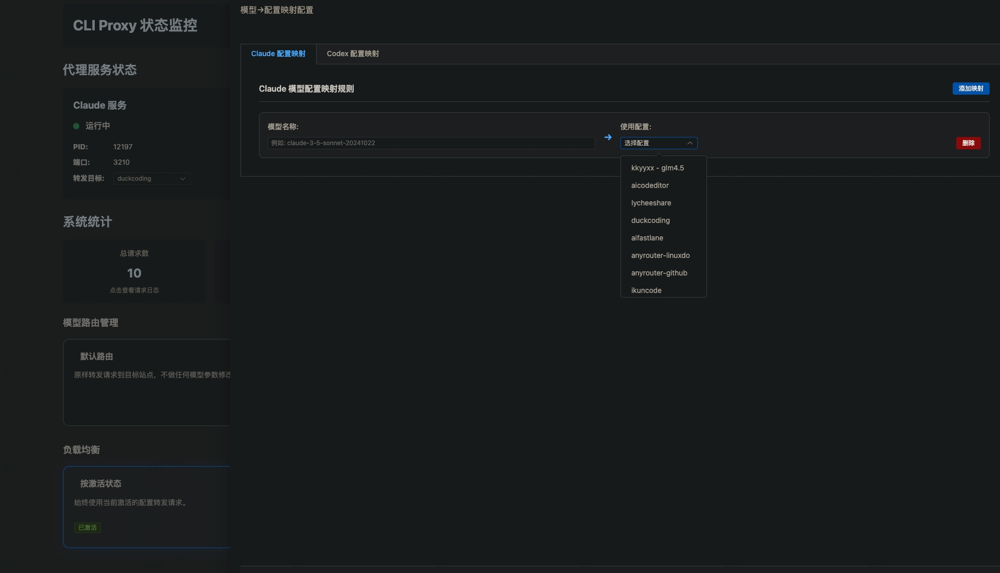

# CLP (CLI Proxy) - 本地 AI 代理工具

> 基于 [guojinpeng/cli_proxy](https://github.com/guojinpeng/cli_proxy) 改造，适配最新版本的 Claude Code，修复原项目存在的兼容性问题。

## 项目简介

CLP 是一个本地 CLI 代理工具，用于管理和代理 AI 服务（Claude、Codex）的 API 请求。提供统一的命令行界面来启动、停止和管理多个 AI 服务代理，支持多配置管理和 Web UI 监控。

### 主要特性

- **动态切换配置** — 命令行/UI 界面动态切换服务配置，无需重启终端，上下文保留
- **敏感数据过滤** — 将敏感数据配置到请求过滤器中，防止泄露
- **多服务支持** — 支持各种中转站配置，无需繁琐调整 JSON 后重启客户端
- **Token 使用统计** — 解析请求中的 Token 使用情况
- **模型路由管理** — 自定义模型路由，灵活控制请求目标站点的模型名称
- **负载均衡** — 按权重的智能负载均衡，失败后自动切换下一站点

### 端口说明

| 端口 | 服务 |
|------|------|
| 3210 | Claude 代理服务 |
| 3211 | Codex 代理服务 |
| 3300 | Web UI 管理界面 |

## 界面预览









## 安装

**前置要求：** Python 3.7+

### 方式一：下载安装包（推荐）

前往 [Releases](https://github.com/codebucket2021/cli_proxy/releases) 页面，下载最新版本的 `.whl` 文件，然后执行：

```bash
pip install clp-x.x.x-py3-none-any.whl
```

> 将 `x.x.x` 替换为实际下载的版本号，例如 `clp-1.10.2-py3-none-any.whl`。

安装完成后即可使用 `clp` 命令。

### 方式二：从源码安装

```bash
# 克隆仓库
git clone https://github.com/codebucket2021/cli_proxy.git
cd cli_proxy

# 安装
pip install -e .
```

安装完成后即可使用 `clp` 命令。从源码安装的好处是后续更新只需 `git pull` 即可，无需重新安装。

### 方式三：Docker 部署

```bash
# 克隆仓库
git clone https://github.com/codebucket2021/cli_proxy.git
cd cli_proxy

# 使用 Docker Compose 启动
docker-compose up -d

# 查看状态
docker-compose ps

# 查看日志
docker-compose logs -f

# 停止
docker-compose down
```

也可以使用 Docker 命令手动部署：

```bash
# 构建镜像
docker build -t clp .

# 运行容器
docker run -d \
  --name clp-proxy \
  -p 3210:3210 \
  -p 3211:3211 \
  -p 3300:3300 \
  -v clp_data:/root/.clp \
  clp
```

## 使用方法

### 基本命令

```bash
clp start      # 启动所有服务
clp stop       # 停止所有服务
clp restart    # 重启所有服务
clp status     # 查看服务状态
clp ui         # 打开 Web UI 界面
clp server     # 服务器模式（前台持久运行）
```

### 配置管理

```bash
clp list claude             # 列出 Claude 所有配置
clp list codex              # 列出 Codex 所有配置
clp active claude prod      # 激活 Claude 的 prod 配置
clp active codex dev        # 激活 Codex 的 dev 配置
```

配置也可以在 Web UI（http://localhost:3300）中快速添加和切换。

## 客户端配置

### Claude Code（命令行）

编辑 `~/.claude/settings.json`：

```json
{
  "env": {
    "ANTHROPIC_AUTH_TOKEN": "-",
    "ANTHROPIC_BASE_URL": "http://127.0.0.1:3210",
    "CLAUDE_CODE_DISABLE_NONESSENTIAL_TRAFFIC": "1",
    "CLAUDE_CODE_ATTRIBUTION_HEADER": "0",
    "CLAUDE_CODE_MAX_OUTPUT_TOKENS": "64000",
    "MAX_THINKING_TOKENS": "31999",
    "DISABLE_AUTOUPDATER": "1"
  },
  "permissions": {
    "allow": [],
    "deny": []
  }
}
```

重启 Claude 命令行即可（确保 `clp start` 已启动）。

### Claude Code（VSCode 扩展）

1. 创建 `~/.claude/config.json`（没有则新建）：

```json
{
  "primaryApiKey": "-"
}
```

2. 打开 VSCode → 扩展 → Claude Code → 设置 → Edit in settings.json，添加：

```json
{
  "claude-code.environmentVariables": [
    {"name": "ANTHROPIC_BASE_URL", "value": "http://127.0.0.1:3210"},
    {"name": "ANTHROPIC_AUTH_TOKEN", "value": "-"}
  ]
}
```

3. 重新打开 Claude Code 对话框。

### Codex

1. 编辑 `~/.codex/config.toml`：

```properties
model_provider="local"
model="gpt-5-codex"
model_reasoning_effort="high"
model_reasoning_summary_format="experimental"
network_access="enabled"
disable_response_storage=true
show_raw_agent_reasoning=true
[model_providers.local]
name="local"
base_url="http://127.0.0.1:3211"
wire_api="responses"
```

2. 编辑 `~/.codex/auth.json`（没有则新建）：

```json
{
  "OPENAI_API_KEY": "-"
}
```

3. 重启 Codex（确保 `clp start` 已启动）。

## 更新

更新后需要重启服务才能生效。先停止正在运行的服务，再重新启动：

```bash
clp stop
clp start
```

如果 `clp stop` 无法正常停止，可以手动结束进程：

```bash
# macOS / Linux
lsof -ti:3210,3211,3300 | xargs kill -9 2>/dev/null

# Windows — 在任务管理器中结束 clp 相关进程，或关闭对应命令行窗口
```

### Release 安装包方式

前往 [Releases](https://github.com/codebucket2021/cli_proxy/releases) 下载最新 `.whl` 文件，然后：

```bash
pip install --force-reinstall clp-x.x.x-py3-none-any.whl
```

### 源码方式

```bash
cd cli_proxy
git pull
pip install -e .
```

### Docker 方式

```bash
cd cli_proxy
git pull
docker-compose up -d --build
```

## 配置文件位置

运行后自动在用户主目录下创建 `~/.clp/` 目录：

| 路径 | 说明 |
|------|------|
| `~/.clp/claude.json` | Claude 服务配置 |
| `~/.clp/codex.json` | Codex 服务配置 |
| `~/.clp/run/` | 运行时文件（PID、日志） |
| `~/.clp/data/` | 数据文件（请求日志、统计） |

## 项目结构

```
src/
├── main.py                        # 主入口
├── core/
│   ├── base_proxy.py              # 基础代理服务类
│   └── realtime_hub.py            # 实时通信
├── claude/
│   ├── configs.py                 # Claude 配置管理
│   ├── ctl.py                     # Claude 服务控制器
│   └── proxy.py                   # Claude 代理服务
├── codex/
│   ├── configs.py                 # Codex 配置管理
│   ├── ctl.py                     # Codex 服务控制器
│   └── proxy.py                   # Codex 代理服务
├── config/
│   ├── config_manager.py          # 配置管理器
│   └── cached_config_manager.py   # 缓存配置管理器
├── filter/
│   ├── request_filter.py          # 请求过滤器
│   └── cached_request_filter.py   # 缓存请求过滤器
├── ui/
│   ├── ctl.py                     # UI 服务控制器
│   ├── ui_server.py               # Flask Web UI
│   └── static/                    # 静态资源
└── utils/
    ├── platform_helper.py         # 平台工具
    └── usage_parser.py            # 使用统计解析
```

## 技术栈

- **Python 3.7+**
- **FastAPI** — 异步 Web 框架，用于代理服务
- **Flask** — Web UI 界面
- **httpx** — 异步 HTTP 客户端
- **uvicorn** — ASGI 服务器
- **psutil** — 进程管理

## 致谢

本项目基于 [guojinpeng/cli_proxy](https://github.com/guojinpeng/cli_proxy) 改造而来，感谢原作者 gjp 的工作。

## 许可证

[MIT License](LICENSE)
